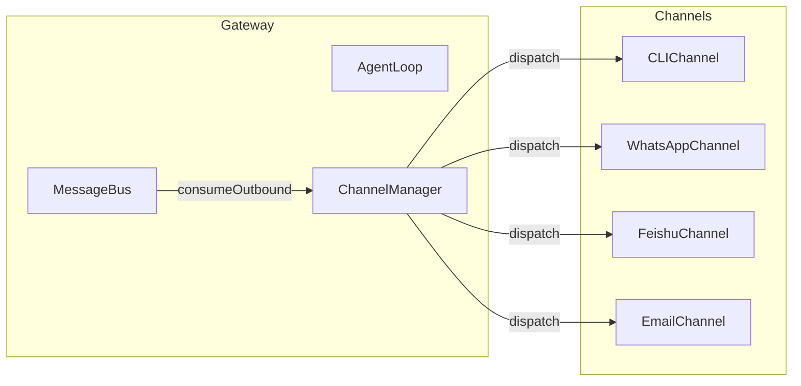
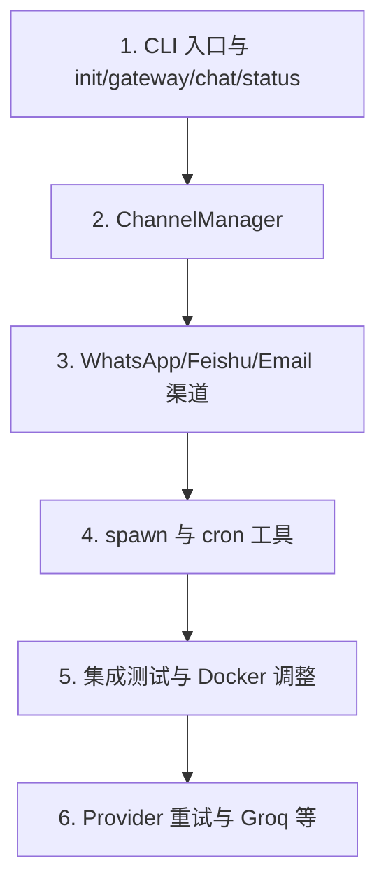

# Nanobot-TS 未完成功能清单

## 一、近期已 completing 的 Core 功能（本次会话前已完成）

以下功能在近期补全中已实现，不再列入未完成清单：

| 模块             | 已完成功能                                                            |
| -------------- | ---------------------------------------------------------------- |
| ContextBuilder | Identity 区块、运行时上下文注入、IDENTITY.md、alwaysSkills/skillsSummary 渐进加载 |
| Session        | lastConsolidated、增量历史获取                                          |
| Memory         | 增量 consolidate、archiveAll、getMemoryContext、readLongTerm、search   |
| Skills         | getAlwaysSkills、buildSkillsSummary、frontmatter、requirements 检查   |
| Agent          | stripThink、/new 归档、工具结果截断                                        |
| Provider       | OpenRouter、DeepSeek（已接入）                                         |
| 会话命令           | /new、/help（已实现）                                                  |

---

## 二、未完成功能清单（按优先级）

### 1. CLI 与入口（高优先级）

**现状**：[src/cli/index.ts](src/cli/index.ts) 仅导出模块，无可执行入口；[src/cli/commands.ts](src/cli/commands.ts) 为占位，`runCLI()` 仅打印信息。

**缺失**：

- 可执行入口：`dist/cli/index.js` 需在作为 bin 时调用 `runCLI()` 并注册子命令
- Commander 子命令注册：init、gateway、chat、status、session、config、channels、logs
- 具体命令实现：
  - `nanobot init`：初始化 `~/.nanobot/config.json` 与工作区
  - `nanobot gateway [--port]`：启动 Bus + Agent + ChannelManager
  - `nanobot chat "<prompt>"` / `nanobot chat --interactive`
  - `nanobot status`
  - `nanobot session list` / `nanobot session clear <id>`
  - `nanobot config set/get`
  - `nanobot channels status`
  - `nanobot logs [--tail N]`（如需要）

**参考**：[docs/DEVELOPMENT-PLAN.md](docs/DEVELOPMENT-PLAN.md) 1.3 节、[docs/PRD.md](docs/PRD.md) 附录。

---

### 2. 渠道管理器（高优先级）

**现状**：[src/channels/index.ts](src/channels/index.ts) 仅导出 base、cli，无 ChannelManager。

**缺失**：

- 新增 `src/channels/manager.ts`
- 按 `config.channels` 加载并 start/stop 各渠道
- 消费 Bus 的 outbound 消息，按 `channel` 分发到对应渠道的 `send()`
- 与 gateway 命令衔接

**数据流**：

---

### 3. 多渠道实现（高优先级）

**现状**：仅有 [src/channels/cli.ts](src/channels/cli.ts)，缺少 WhatsApp、Feishu、Email。

| 渠道       | 文件                         | 依赖                                       | 参考                   |
| -------- | -------------------------- | ---------------------------------------- | -------------------- |
| WhatsApp | `src/channels/whatsapp.ts` | baileys（已在 package.json）                 | DEVELOPMENT-PLAN 6.1 |
| Feishu   | `src/channels/feishu.ts`   | @larksuiteoapi/node-sdk（已在 package.json） | DEVELOPMENT-PLAN 6.2 |
| Email    | `src/channels/email.ts`    | imapflow + nodemailer（已在 package.json）   | DEVELOPMENT-PLAN 6.3 |

各渠道需实现 `BaseChannel`，在 start/stop 中连接/断开，消息转为 `InboundMessage` 并 `publishInbound`，通过 `send()` 发送 `OutboundMessage`。

**配置**：[src/config/schema.ts](src/config/schema.ts) 中已有 WhatsAppConfigSchema、FeishuConfigSchema、EmailConfigSchema。

---

### 4. 工具扩展（中优先级）

| 工具    | 文件                   | 说明                                                                                                       |
| ----- | -------------------- | -------------------------------------------------------------------------------------------------------- |
| spawn | `src/tools/spawn.ts` | PRD F3：后台子代理，启动子进程/子 Agent 并返回结果或句柄                                                                      |
| cron  | `src/tools/cron.ts`  | PRD F9/Phase 4：定时任务，与 Bus/Agent 联动，参考 [nanobot/agent/tools/cron.py](nanobot/nanobot/agent/tools/cron.py) |

---

### 5. LLM Provider 扩展（低优先级）

- **Groq**：PRD F7 提及，需在 schema 与 registry 中接入
- **错误重试与 Rate limit**：PRD 要求「自动错误重试、Rate limit 处理」，当前 Provider 层尚未实现

---

### 6. 测试（中优先级）

| 类型   | 现状                     | 建议                                           |
| ---- | ---------------------- | -------------------------------------------- |
| 单元测试 | 已有 bus、tools、storage   | 补充 core/agent、channels、context、memory、skills |
| 集成测试 | 无 `tests/integration/` | 新增 agent 端到端、Bus + Channel 联动等               |

---

### 7. 部署与运维（Phase 3）

| 项目             | 现状                                 | 说明                                      |
| -------------- | ---------------------------------- | --------------------------------------- |
| Dockerfile     | 已存在                                | 使用 `npm ci`，与 pnpm 项目管理不符，建议改为 pnpm     |
| HEALTHCHECK    | 访问 `http://localhost:18790/health` | gateway 为 CLI 模式，无 HTTP 服务，需移除或调整为适合的检查 |
| docker-compose | 已存在                                | 可沿用，需与 Dockerfile 调整一致                  |
| 部署指南           | 缺失                                 | 可补充部署步骤与配置说明                            |

---

### 8. 可选增强（Phase 4）

- **MCP 支持**：文档列为可选，当前未实现
- **心跳机制**：文档列为可选，当前未实现
- **内置技能模板**：`templates/skills/` 下 weather、github、memory 等 SKILL.md 可参考 [nanobot/skills/](nanobot/nanobot/skills/)

---

## 三、建议实现顺序

1. **CLI**：补全可执行入口和 init、gateway、chat、status，使 `nanobot init` 与 `nanobot gateway` 可运行
2. **ChannelManager**：实现渠道加载与 outbound 分发
3. **多渠道**：按优先级实现 WhatsApp、Feishu、Email
4. **spawn / cron**：实现工具并接入 Agent
5. **集成测试与 Docker**：补充 integration 测试，并调整 Dockerfile/HEALTHCHECK
6. **Provider 增强**：重试、Rate limit、Groq 等
7. **Phase 4 可选**：MCP、心跳、技能模板

---

## 四、关键文件索引

| 用途        | 路径                                                                                               |
| --------- | ------------------------------------------------------------------------------------------------ |
| 未实现功能计划   | [.cursor/plans/nanobot_未实现功能清单_2ab25eb9.plan.md](.cursor/plans/nanobot_未实现功能清单_2ab25eb9.plan.md) |
| PRD       | [docs/PRD.md](docs/PRD.md)                                                                       |
| 开发计划      | [docs/DEVELOPMENT-PLAN.md](docs/DEVELOPMENT-PLAN.md)                                             |
| 渠道与工具规划   | DEVELOPMENT-PLAN 6.1–6.3、tools 相关节                                                               |
| 现有渠道      | [src/channels/](src/channels/)                                                                   |
| 现有工具      | [src/tools/](src/tools/)                                                                         |
| Python 参考 | [nanobot/agent/](nanobot/nanobot/agent/)                                                         |

