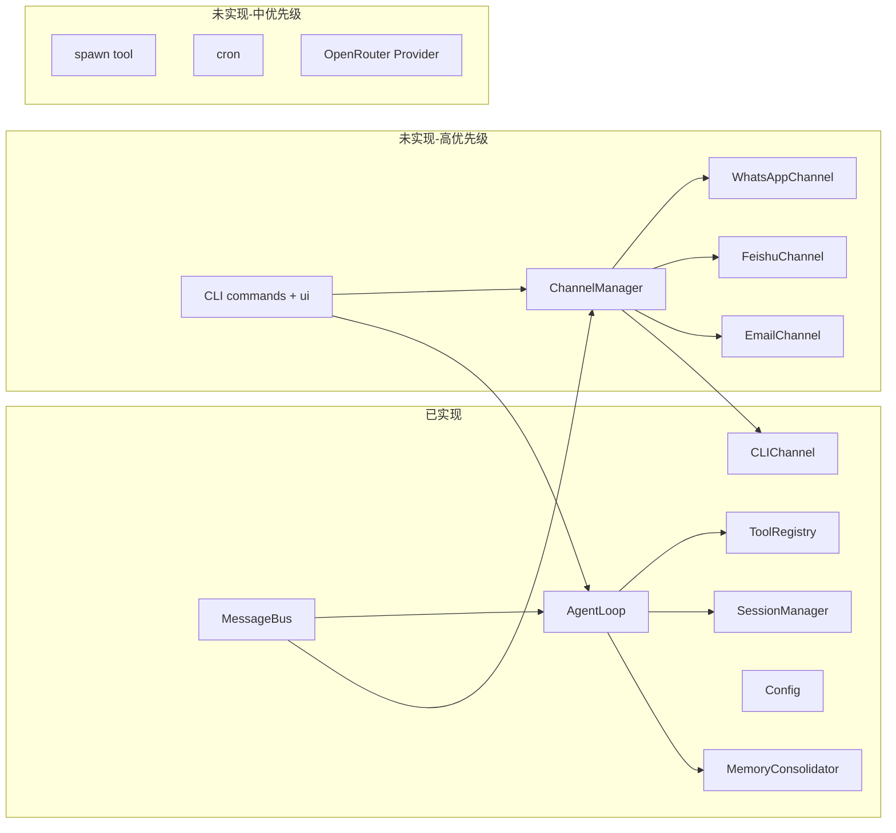

# Nanobot-TS 未实现功能清单

## 一、当前已实现模块概览

| 模块                    | 状态  | 说明                                                                                                                          |
| --------------------- | --- | --------------------------------------------------------------------------------------------------------------------------- |
| **消息总线 (F1)**         | 已实现 | [src/bus/queue.ts](src/bus/queue.ts)、[src/bus/events.ts](src/bus/events.ts)：publishInbound/Outbound、consumeInbound/Outbound |
| **Agent Loop (F2)**   | 已实现 | [src/core/agent.ts](src/core/agent.ts)：run()、process()、工具调用循环、maxIterations/memoryWindow                                    |
| **工具系统 (部分)**         | 已实现 | read_file、write_file、edit_file、list_dir、exec、web_search、web_fetch、message（[src/tools/](src/tools/)）                         |
| **渠道 (部分)**           | 已实现 | [BaseChannel](src/channels/base.ts)、[CLIChannel](src/channels/cli.ts)                                                       |
| **会话管理 (F5)**         | 已实现 | [src/storage/session.ts](src/storage/session.ts)：SessionManager get/save/delete，JSONL 存储                                    |
| **内存系统 (F6)**         | 已实现 | [src/core/memory.ts](src/core/memory.ts)：MemoryConsolidator、MEMORY.md/HISTORY.md                                            |
| **LLM Provider (部分)** | 已实现 | [src/providers/registry.ts](src/providers/registry.ts)：OpenAI、Anthropic；配置含 OpenRouter 但未接入调用                               |
| **配置系统 (F8)**         | 已实现 | [src/config/schema.ts](src/config/schema.ts)、[loader.ts](src/config/loader.ts)：Zod Schema、cosmiconfig，含渠道/工具/Provider 配置    |
| **技能系统 (F9)**         | 已实现 | [src/core/skills.ts](src/core/skills.ts)：SkillLoader，按 workspace/skills 加载 SKILL.md                                         |
| **上下文构建**             | 已实现 | [src/core/context.ts](src/core/context.ts)：ContextBuilder.buildMessages                                                     |
| **工作区模板**             | 已存在 | [templates/workspace/](templates/workspace/)：AGENTS.md、SOUL.md、USER.md、TOOLS.md、memory/MEMORY.md                            |
| **单元测试**              | 部分  | [tests/unit/](tests/unit/)：bus、tools、storage；无 core/agent、channels、integration                                              |

---

## 二、未实现功能清单

### 1. 渠道层（高优先级，PRD Phase 2）

- **WhatsApp 渠道**：未实现。配置 Schema 已有 [WhatsAppConfigSchema](src/config/schema.ts)；需新增 `src/channels/whatsapp.ts`，使用 baileys（已安装），实现 start/stop/send、二维码登录、消息转 InboundMessage 并 publishInbound。可参考 [DEVELOPMENT-PLAN.md 6.1 节](docs/DEVELOPMENT-PLAN.md)。
- **Feishu 渠道**：未实现。配置已有 FeishuConfigSchema；需新增 `src/channels/feishu.ts`，使用 @larksuiteoapi/node-sdk，实现 WebSocket 订阅与消息收发。可参考 DEVELOPMENT-PLAN 6.2 节。
- **Email 渠道**：未实现。配置已有 EmailConfigSchema；需新增 `src/channels/email.ts`，使用 imapflow + nodemailer，实现 IMAP 轮询与 SMTP 发送。可参考 DEVELOPMENT-PLAN 6.3 节。
- **渠道管理器**：未实现。需新增 `src/channels/manager.ts`，根据 config.channels 动态加载并 start/stop 各渠道，将出站消息按 channel 分发到对应渠道的 send()。[channels/index.ts](src/channels/index.ts) 当前仅导出 base 与 cli。

### 2. CLI 与入口（高优先级）

- **CLI 命令实现**：[src/cli/index.ts](src/cli/index.ts) 引用了 `./commands` 和 `./ui`，但 **src/cli/commands.ts 与 src/cli/ui.ts 不存在**，会导致构建或运行时缺失。PRD 附录与 package.json scripts 要求的命令包括：
  - `nanobot init`：初始化配置与工作区
  - `nanobot gateway [--port]`：启动总线 + Agent + 渠道管理器
  - `nanobot chat "<prompt>"` / `nanobot chat --interactive`
  - `nanobot status`
  - `nanobot session list` / `nanobot session clear <id>`
  - `nanobot config set/get`
  - `nanobot channels status`
  - `nanobot logs [--tail N]`
- 需要新增 `src/cli/commands.ts`（或 commands/ 子模块）和 `src/cli/ui.ts`，使用 commander 注册上述子命令，并复用现有 Config、MessageBus、AgentLoop、SessionManager、ChannelManager（待实现）。

### 3. 工具与能力（中优先级）

- **spawn 工具**：PRD F3 要求「生成后台子代理」工具，当前 [src/tools/index.ts](src/tools/index.ts) 仅导出 filesystem、shell、web、message，无 spawn。需新增工具（如 `src/tools/spawn.ts`），在受控环境下启动子 Agent/子进程并返回结果或句柄。
- **cron 定时任务**：PRD F9 与 Phase 4 提到 cron 技能/定时任务；DEVELOPMENT-PLAN 目录中有 `tools/cron.ts` 的规划，当前未实现。需设计 cron 工具或技能（注册定时任务、与 Bus/Agent 联动）。

### 4. LLM Provider 扩展（中优先级）

- **OpenRouter**：config 中已有 openrouter 的 apiKey/apiBase，[providers/registry.ts](src/providers/registry.ts) 仅实现 OpenAI 与 Anthropic，未根据 `model` 前缀（如 `openrouter:...`）调用 OpenRouter。需在 LLMProvider 中增加 openrouter 分支（通常复用 OpenAI 兼容 API + baseURL）。
- **DeepSeek / Groq 等**：PRD F7 列出 DeepSeek、Groq 等，当前 Schema 与 Provider 均未实现，可作为后续扩展。

### 5. 会话与记忆增强（低～中优先级）

- **会话命令**：PRD F5 要求「实现会话命令（/new、/help）」；需在 Agent 或渠道层识别这些命令并执行新建会话、帮助说明，而不是当作普通消息发给 LLM。
- **长期记忆搜索**：PRD F6 提到「支持关键词搜索历史」；当前 MemoryConsolidator 主要做 consolidate 写入 MEMORY.md/HISTORY.md，未实现 readLongTerm 或关键词搜索接口，需在 memory 或 storage 层补充。

### 6. 测试与交付（中优先级）

- **集成测试**：DEVELOPMENT-PLAN Phase 2 要求 integration 测试；当前仅有 [tests/unit/](tests/unit/)，无 `tests/integration/`（如 agent 端到端、渠道与 bus 联动）。
- **核心/渠道测试**：core/agent、channels 暂无单元测试；可增加 agent.test.ts、channel manager 与各 channel 的 mock 测试。

### 7. 部署与运维（Phase 3）

- **Docker**：PRD Phase 3 要求 Docker 镜像与部署指南。需添加 `Dockerfile` 与 `docker-compose.yml`（DEVELOPMENT-PLAN 8.2 有示例），并确保入口为 `node dist/cli/index.js gateway`。
- **错误处理与重试**：PRD 要求「自动错误重试、Rate limit 处理」；当前 Provider 层可补充重试与退避策略。
- **日志与监控**：已有 pino；可统一网关/渠道/Agent 的日志格式，并视需求补充 `nanobot logs` 实现（如读本地日志文件或对接日志服务）。

### 8. 可选增强（Phase 4）

- **MCP 支持**：文档中列为可选，当前未实现。
- **心跳机制**：文档中列为可选，当前未实现。
- **内置技能模板**：PRD 提到 weather、github、memory 等内置技能；templates 中仅有 workspace，无 `templates/skills/` 下各技能 SKILL.md；可按需补充。

---

## 三、架构关系简图（当前 vs 目标）

---

## 四、建议实现顺序

1. **修复 CLI**：补全 `commands.ts`、`ui.ts`，实现 `init`、`gateway`、`chat`、`status`，使 `pnpm run build && pnpm start` 或 `nanobot gateway` 可运行。
2. **渠道管理器 + 多渠道**：实现 ChannelManager，再按优先级实现 WhatsApp、Feishu、Email，使 gateway 能真正多端收发。
3. **OpenRouter**：在 LLMProvider 中接入 OpenRouter，便于多模型切换。
4. **spawn / cron**：按产品需求决定是否在 MVP 内实现。
5. **集成测试与 Docker**：补齐 integration 测试与 Dockerfile/docker-compose，满足 Phase 3 交付。
6. **会话命令与记忆搜索**：在 Agent/渠道层实现 /new、/help；在 memory 层实现简单关键词搜索。
7. **Phase 4 可选**：MCP、心跳、更多 Provider、更多技能模板。

---

## 五、关键文件索引

| 用途        | 路径                                                                              |
| --------- | ------------------------------------------------------------------------------- |
| 需求与路线图    | [docs/PRD.md](docs/PRD.md)、[docs/DEVELOPMENT-PLAN.md](docs/DEVELOPMENT-PLAN.md) |
| API 约定    | [docs/API.md](docs/API.md)                                                      |
| 渠道配置与示例   | [src/config/schema.ts](src/config/schema.ts)、DEVELOPMENT-PLAN 第 6 节             |
| 现有渠道与总线   | [src/channels/](src/channels/)、[src/bus/queue.ts](src/bus/queue.ts)             |
| Agent 与工具 | [src/core/agent.ts](src/core/agent.ts)、[src/tools/](src/tools/)                 |

以上清单可直接用于排期与任务拆分；若需要我针对某一项（如「先只做 CLI + ChannelManager」）给出更细的步骤与接口设计，可以指定范围。