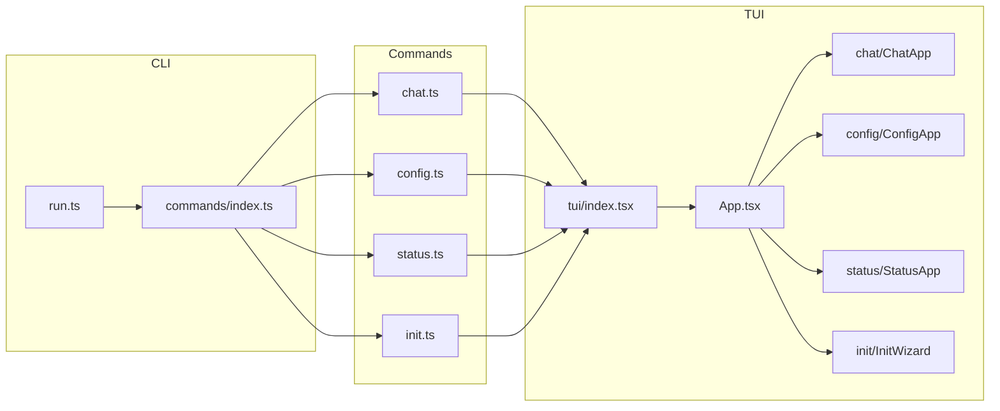

# OpenTUI CLI 集成计划

## 目标与范围

- **纳入 TUI 的命令**：`chat`、`config`、`status`、`init`（直接替换为 TUI，无 `--tui` 开关）
- **保持不变**：`[src/cli/setup.ts](src/cli/setup.ts)`、`[src/cli/run.ts](src/cli/run.ts)`；gateway、session、channels、logs、mcp、whatsapp-auth 仍使用现有 `[src/cli/ui.ts](src/cli/ui.ts)` + console
- **技术选型**：OpenTUI React（与现有 React 生态一致，便于组件化）

## 架构与数据流

- 各命令在 `action` 里不再直接 `runChat`/`runConfig`/… 的 console 逻辑，改为调用**统一 TUI 入口**并传入 `mode: 'chat' | 'config' | 'status' | 'init'`。
- TUI 入口 `[src/cli/tui/index.tsx](src/cli/tui/index.tsx)` 使用 `createCliRenderer` + `createRoot(renderer).render(<App mode={mode} />)`，根据 `mode` 渲染对应子应用（ChatApp / ConfigApp / StatusApp / InitWizard）。
- 退出统一用 `renderer.destroy()`，不在 TUI 内直接 `process.exit()`（见 [OpenTUI gotchas](.agents/skills/opentui/references/core/gotchas.md)）。

## 1. 依赖与构建配置

- **依赖**：在 [package.json](package.json) 增加 `@opentui/core`、`@opentui/react`、`react`（>=19），以及 dev 的 `@types/react`。
- **TypeScript**：在 [tsconfig.json](tsconfig.json) 中为 TUI 启用 JSX（仅影响 `src/cli/tui/`** 时可考虑 `include` 已含 `src/**/`* 下增加对 `.tsx` 的支持）：
  - `"jsx": "react-jsx"`
  - `"jsxImportSource": "@opentui/react"`
  - 若全局加 JSX 影响其他 TS 文件，可改为在 `src/cli/tui` 下使用单独 `tsconfig.json` 继承根配置并只覆盖 `jsx`/`jsxImportSource`，或保证仅 tui 目录含 `.tsx`。
- **构建**：[bun.config.ts](bun.config.ts) 增加 TUI 入口，例如 `./src/cli/tui/index.tsx`，输出到 `dist`（与现有 `run.ts` 等一致），以便 `run.ts` 或命令里可 `import` 或通过子进程启动 TUI。若采用「命令内直接 import 并执行 TUI」，则需保证该入口被同一 build 包含（例如作为 run.ts 的依赖被卷入，或单独 entrypoint 再在 run 时 spawn）。推荐：**单次 build 包含 run.ts，run.ts 动态 import 同一 dist 下的 tui 入口**，这样只需在 bun build 的 entrypoints 中加入 `./src/cli/tui/index.tsx`，或由 run.ts 的静态 import 拉取（见下节）。

## 2. 目录与文件（按你给出的结构）

| 路径                                       | 职责                                                                                   |
| ---------------------------------------- | ------------------------------------------------------------------------------------ |
| `src/cli/tui/index.tsx`                  | 创建 renderer、createRoot、根据 CLI 传入的 mode 渲染 `<App mode={…} />`；导出 `runTui(mode)` 供命令调用 |
| `src/cli/tui/App.tsx`                    | 主壳：应用 theme、Layout，根据 `mode` 渲染 ChatApp / ConfigApp / StatusApp / InitWizard         |
| `src/cli/tui/theme.ts`                   | 主题（颜色、边框等）常量或与 `renderer.themeMode` 联动                                               |
| `src/cli/tui/components/Layout.tsx`      | 通用布局（如顶部/底栏 + 主区域）                                                                   |
| `src/cli/tui/components/MessageList.tsx` | 通用消息列表展示（供 chat 等复用）                                                                 |
| `src/cli/tui/chat/ChatApp.tsx`           | 聊天主界面：上方消息列表 + 下方输入框；内部调用 `requireConfig`/`buildAgentRuntime`，用 agent 处理发送与流式输出      |
| `src/cli/tui/chat/ChatInput.tsx`         | 单行/多行输入，发送按钮或回车发送                                                                    |
| `src/cli/tui/chat/ChatMessages.tsx`      | 展示对话列表（用户/助手消息），可结合 `<scrollbox>`                                                    |
| `src/cli/tui/config/ConfigApp.tsx`       | 配置查看/编辑主界面                                                                           |
| `src/cli/tui/config/ConfigForm.tsx`      | 键值表单（如 key/value 编辑）                                                                 |
| `src/cli/tui/config/ConfigEditor.tsx`    | 原始 JSON 编辑（若需要）                                                                      |
| `src/cli/tui/status/StatusApp.tsx`       | 状态总览容器                                                                               |
| `src/cli/tui/status/StatusDashboard.tsx` | 展示 config path、workspace、sessions 等                                                  |
| `src/cli/tui/status/StatusCard.tsx`      | 单块信息卡片                                                                               |
| `src/cli/tui/init/InitWizard.tsx`        | 多步向导容器，步骤状态与进度                                                                       |
| `src/cli/tui/init/InitStep.tsx`          | 单步 UI（目录创建、config 写入、模板复制等）                                                          |
| `src/cli/tui/init/InitProgress.tsx`      | 进度与结果展示                                                                              |

各子模块的 `index.ts` 仅做 re-export，便于 `App.tsx` 引用。

## 3. 命令层修改（仅 chat / config / status / init）

- **[src/cli/commands/chat.ts](src/cli/commands/chat.ts)**  
  - `action` 改为：调用 `runTui('chat')`（并可传入 `prompt?: string`, `interactive?: boolean`，由 TUI 入口通过 props 或 context 传给 ChatApp）。  
  - 原 `runChat` 中的 `requireConfig`、`buildAgentRuntime`、readline 逻辑**迁移到** `ChatApp` 内（在 TUI 挂载后异步加载 config 与 agent，消息列表与输入在 React 状态中维护）。
- **[src/cli/commands/config.ts](src/cli/commands/config.ts)**  
  - `action` 改为：调用 `runTui('config')`，可选传入 `key`/`value`（若保留 URL 式单次查看/设置，可先进入 TUI 后预填）。
- **[src/cli/commands/status.ts](src/cli/commands/status.ts)**  
  - `action` 改为：调用 `runTui('status')`。原 `runStatus` 中 `requireConfig`、`SessionManager`、`listSessions` 逻辑**迁移到** StatusApp/StatusDashboard（TUI 内异步拉取并展示）。
- **[src/cli/commands/init.ts](src/cli/commands/init.ts)**  
  - `action` 改为：调用 `runTui('init')`，可选传入 `force?: boolean`。原 `runInit` 的步骤（ensureDir、写 config、写 mcp、复制模板与 memory）拆成 InitWizard 的多个 InitStep，在 TUI 中逐步执行并用 InitProgress 展示进度；完成后在 TUI 内调用 `renderer.destroy()` 退出。
- **TUI 入口约定**：对外暴露一个异步函数，例如：
  - `runTui(mode: 'chat' | 'config' | 'status' | 'init', options?: { prompt?: string; interactive?: boolean; key?: string; value?: string; force?: boolean })`
  - 内部创建 renderer、createRoot、render `<App mode={mode} {...options} />`，并在 App 里把 options 传给对应子应用。

## 4. ui.ts 与兼容

- **[src/cli/ui.ts](src/cli/ui.ts)** 保留不动，继续给 gateway、session、channels、logs、mcp、whatsapp-auth 使用。
- 若 init 的某步需要「确认覆盖」等简单提示，可在 InitWizard 内用 OpenTUI 的 `<select>` 或自定义按钮完成，不再依赖 inquirer；若后续有命令从 console 迁到 TUI，再逐步减少对 ui.ts 的依赖。

## 5. 实现顺序建议

1. **基础层**：依赖、tsconfig（及必要时 tui 子 tsconfig）、bun 构建加入 tui 入口；实现 `tui/index.tsx`（仅创建 renderer + 根节点 + 简单 `<text>mode: {mode}</text>`）和 `tui/App.tsx`（按 mode 占位渲染四个子应用组件壳），并实现 `runTui(mode, options)`。
2. **命令切过去**：将 chat、config、status、init 的 action 改为调用 `runTui(...)`，确认无参数时能打开对应 TUI 且退出（如 Ctrl+C）正常。
3. **主题与布局**：`theme.ts`、`Layout.tsx`、`MessageList.tsx`，并在各子 App 中套用。
4. **Chat**：ChatApp/ChatInput/ChatMessages，接入 agent 与消息状态；支持单次 prompt 与 interactive 两种用法（可由 options 传入）。
5. **Config**：ConfigApp + ConfigForm（+ 可选 ConfigEditor），接入 `requireConfig()` 与只读/编辑逻辑。
6. **Status**：StatusApp + StatusDashboard + StatusCard，接入 `requireConfig`、SessionManager、listSessions。
7. **Init**：InitWizard + InitStep + InitProgress，把现有 init 逻辑按步骤拆入并展示进度，支持 `force`。

## 6. 注意事项

- **退出**：所有退出路径使用 `renderer.destroy()`，必要时再 `process.exit()`，避免终端状态错乱。
- **Bun**：OpenTUI 要求 Bun 环境，与当前项目一致；无需 Node 兼容层。
- **错误处理**：config 缺失、agent 构建失败等，在 TUI 内以错误状态展示（如 StatusCard 或专用错误框），并允许用户按键退出，避免未 destroy 就 exit。

按上述步骤即可在保持现有命令与 run/setup 不变的前提下，将 chat、config、status、init 四个命令完整切换为 OpenTUI 界面，并为后续其他命令迁移 TUI 留出扩展空间。