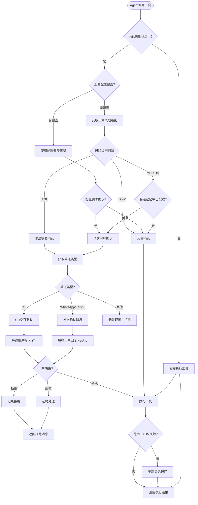
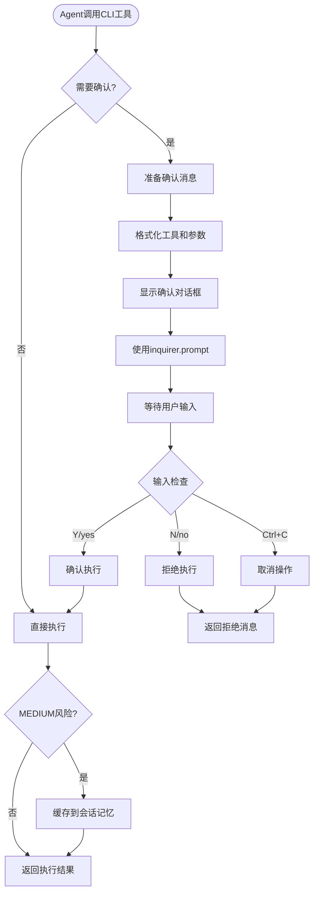
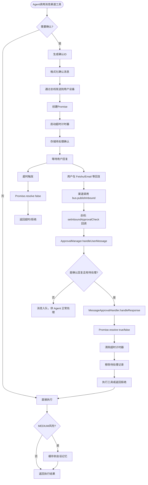
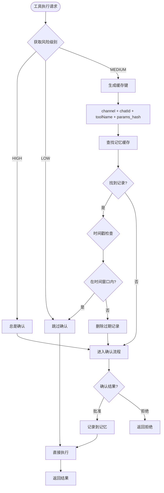
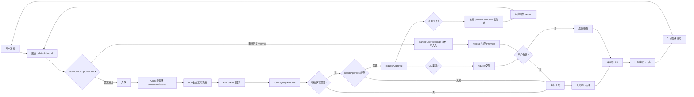
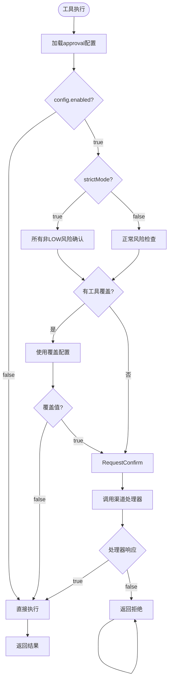
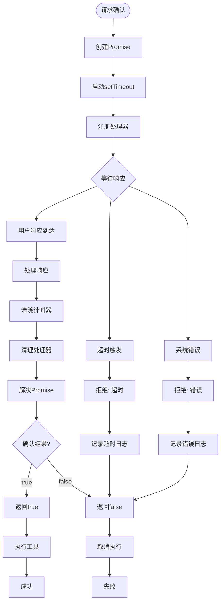

## 🎨 人机交互确认流程图

### 完整流程架构

---

### CLI渠道详细流程

---

### 消息渠道详细流程

消息渠道的 yes/no 在**入队前**即被处理，避免 Agent 阻塞在 `requestConfirmation` 时无法消费队列中的回复。

要点：yes/no 在 `publishInbound` 时经 `handleUserMessage` 识别并 resolve 对应 Promise，**不再入队**，因此不会出现「回复已发送但 Agent 阻塞在等待审批导致超时」的问题。

---

### 会话记忆管理流程

---

### 集成到Agent主循环

- **工具执行与确认**：由 ToolRegistry 在 execute 时调用 ApprovalManager（needsApproval / requestApproval），按渠道选用 CLI 或 Message 处理器。
- **消息渠道的 yes/no**：在**入队前**由总线处理。`bus.setInboundApprovalCheck(fn)` 在 setup 中挂接为 `approvalManager.handleUserMessage`；渠道调用 `publishInbound` 时先执行该回调，若返回 true 表示已作为审批回复处理，消息**不入队**，Agent 主循环不会收到该条消息。
- **Agent 主循环**：只消费队列中的入站消息并交给 `_processMessage`，不再参与审批回复判断（审批回复已在 publishInbound 时消费）。

---

### 配置驱动决策流程

---

### 超时和错误处理流程

---

### 流程说明

#### 关键决策点

1. **启用检查**: 配置`approval.enabled`是否为true
2. **风险级别**: 
   - LOW: 无需确认
   - MEDIUM: 首次确认，会话记忆
   - HIGH: 总是确认
3. **配置覆盖**: `toolOverrides`可覆盖默认策略
4. **渠道类型**: CLI使用inquirer，消息渠道使用回复
5. **超时处理**: 默认60秒，超时自动拒绝

#### 会话记忆机制

- 生成唯一键: `channel:chatId:toolName:params_hash`
- 时间窗口: 默认300秒(5分钟)
- 自动清理过期记录

#### 错误处理

- 超时: 自动拒绝，记录日志
- 错误: 捕获异常，返回false
- 用户中断(Ctrl+C): 视为拒绝