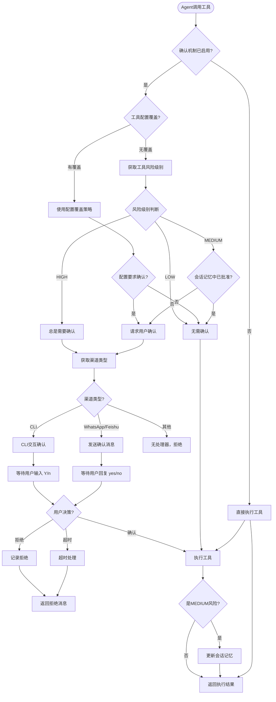
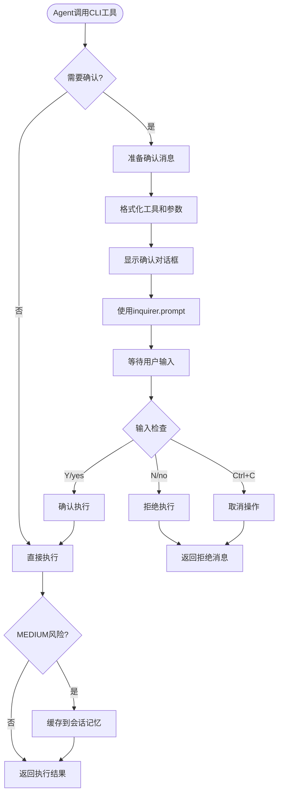
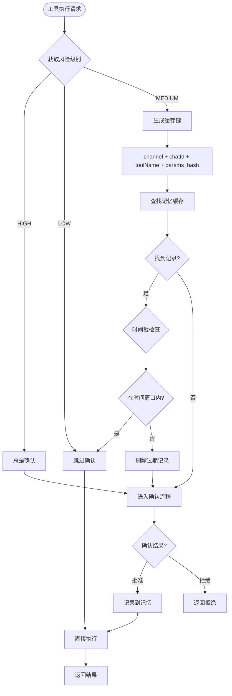
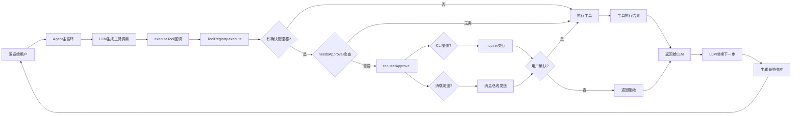
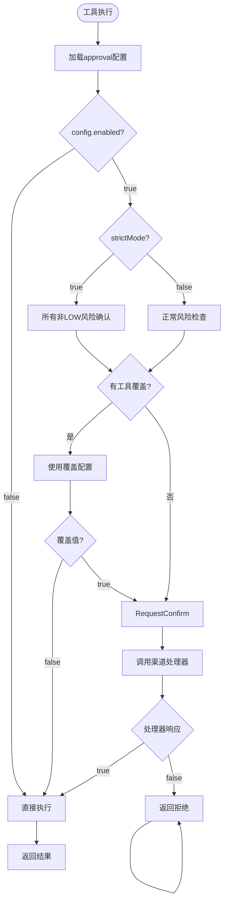
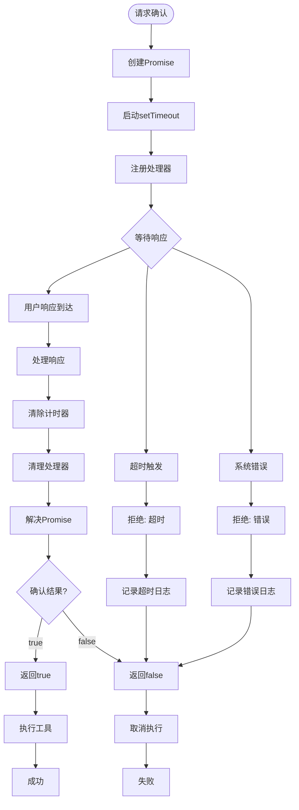

## 🎨 人机交互确认流程图

### 完整流程架构



---

### CLI渠道详细流程



---

### 消息渠道详细流程

```mermaid
graph TD
    Start([Agent调用消息渠道工具]) --> NeedsConfirm{需要确认?}
    
    NeedsConfirm -->|否| Execute[直接执行]
    NeedsConfirm -->|是| GenerateID[生成确认ID]
    
    GenerateID --> FormatMessage[格式化确认消息]
    FormatMessage --> SendMessage[发送到用户设备]
    
    SendMessage --> CreatePromise[创建Promise]
    CreatePromise --> StartTimeout[启动超时计时器]
    
    StartTimeout --> StorePending[存储待处理确认]
    StorePending --> WaitForResponse[等待用户回复]
    
    WaitForResponse --> IncomingMessage[接收到消息]
    IncomingMessage --> IsApprovalMsg{是确认回复?}
    
    IsApprovalMsg -->|否| NormalProcess[正常消息处理]
    IsApprovalMsg -->|是| ParseResponse[解析回复内容]
    
    ParseResponse --> ResponseCheck{回复类型?}
    
    ResponseCheck -->|yes/y| ResolveTrue[Promise.resolve true]
    ResponseCheck -->|no/n| ResolveFalse[Promise.resolve false]
    
    ResolveTrue --> ClearTimeout[清除超时计时器]
    ResolveFalse --> ClearTimeout
    
    ClearTimeout --> RemovePending[移除待处理记录]
    RemovePending --> ExecuteCheck{执行决策}
    
    ExecuteCheck -->|确认| Execute
    ExecuteCheck -->|拒绝| ReturnReject[返回拒绝消息]
    
    Execute --> CheckMedium{MEDIUM风险?}
    CheckMedium -->|是| CacheApproval[缓存到会话记忆]
    CheckMedium -->|否| ReturnSuccess
    
    CacheApproval --> ReturnSuccess[返回执行结果]
    NormalProcess --> [继续正常流程]
    
    WaitForResponse --> TimeoutTrigger[超时触发]
    TimeoutTrigger --> RejectPromise[Promise.reject]
    RejectPromise --> ReturnTimeout[返回超时消息]
```

---

### 会话记忆管理流程



---

### 集成到Agent主循环



---

### 配置驱动决策流程



---

### 超时和错误处理流程



---

### 流程说明

#### 关键决策点

1. **启用检查**: 配置`approval.enabled`是否为true
2. **风险级别**: 
   - LOW: 无需确认
   - MEDIUM: 首次确认，会话记忆
   - HIGH: 总是确认
3. **配置覆盖**: `toolOverrides`可覆盖默认策略
4. **渠道类型**: CLI使用inquirer，消息渠道使用回复
5. **超时处理**: 默认60秒，超时自动拒绝

#### 会话记忆机制

- 生成唯一键: `channel:chatId:toolName:params_hash`
- 时间窗口: 默认300秒(5分钟)
- 自动清理过期记录

#### 错误处理

- 超时: 自动拒绝，记录日志
- 错误: 捕获异常，返回false
- 用户中断(Ctrl+C): 视为拒绝