# Nanobot Gateway 模式可视化流程图

## 1. 系统架构总览

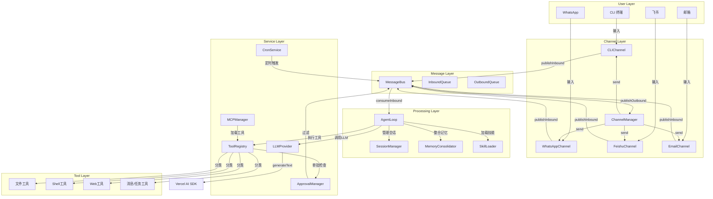

## 2. 入站消息处理流程

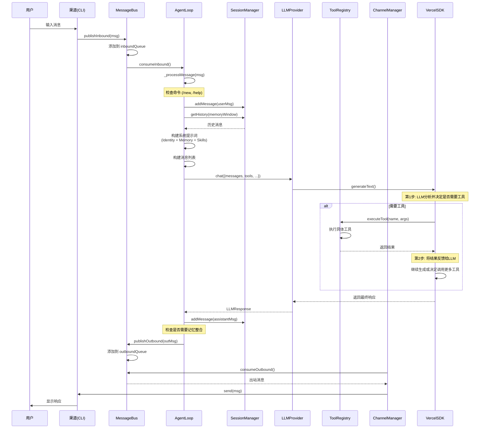

## 3. 多渠道并行处理流程

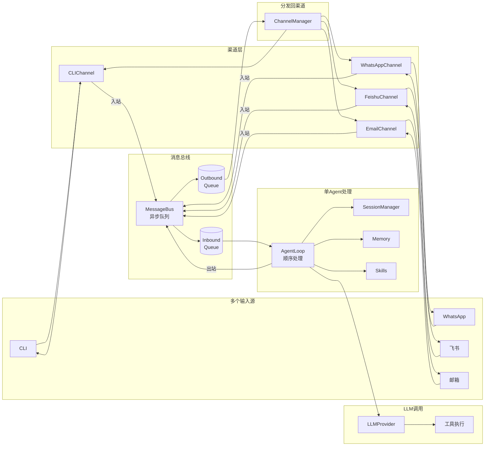

## 4. 工具执行详细流程

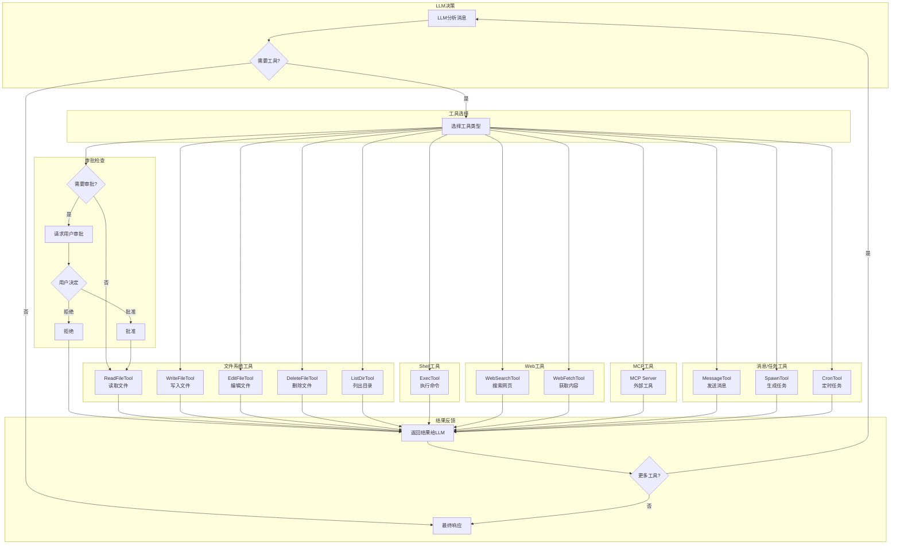

## 5. 记忆整合流程

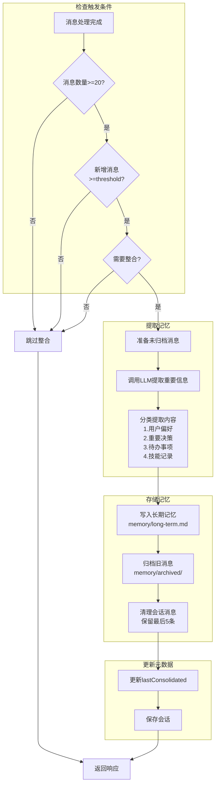

## 6. 定时任务处理流程

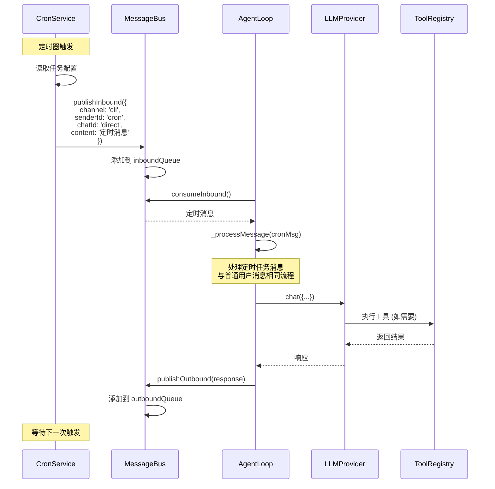

## 7. 错误处理流程

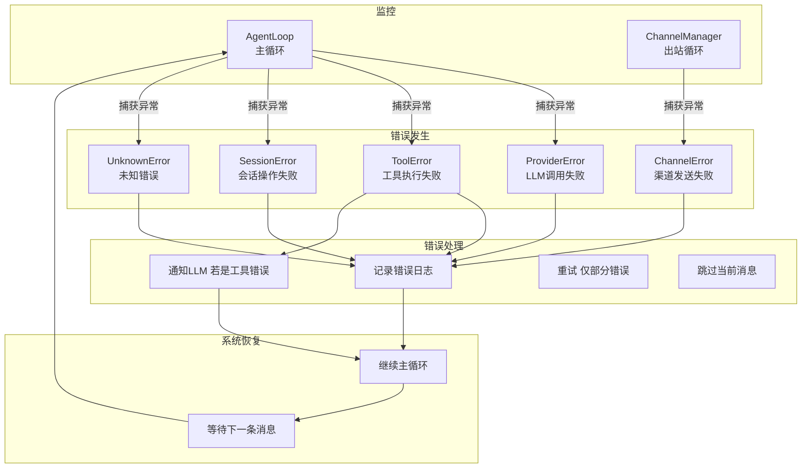

## 8. 审批系统流程

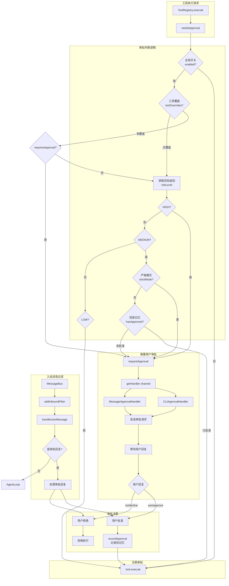

## 9. MCP 工具加载流程

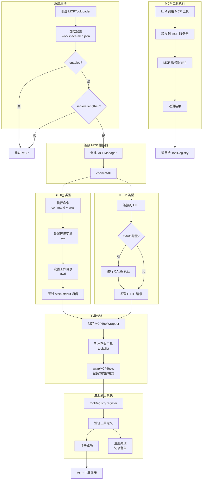

## 10. 技能加载和使用流程

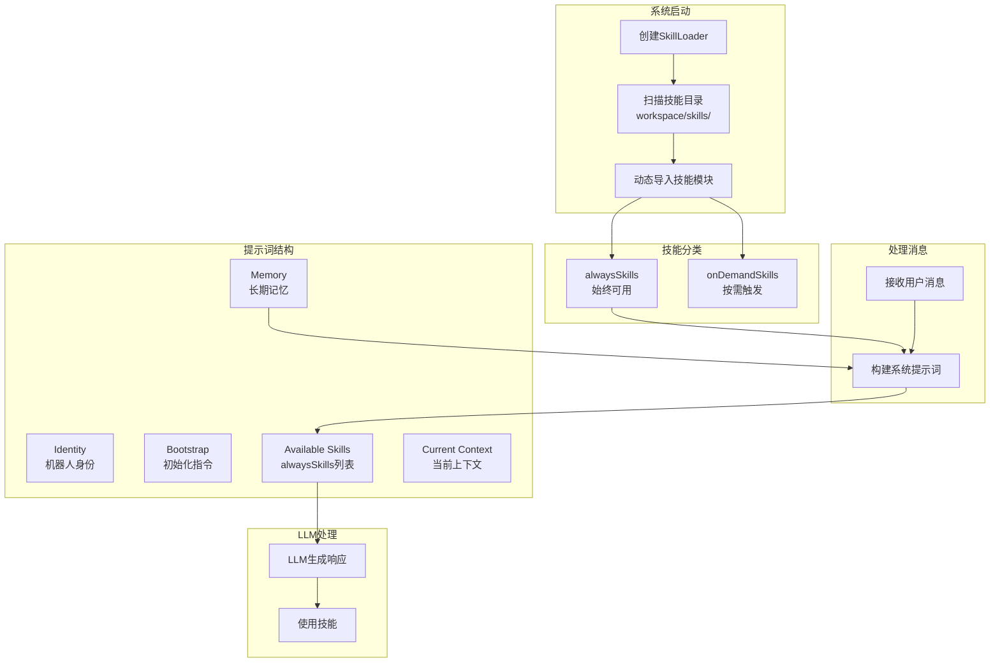

## 11. 会话管理流程

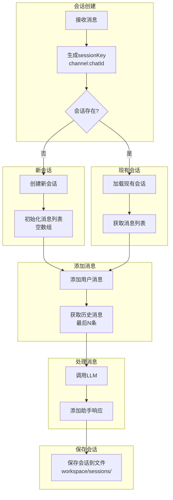

## 12. 启动和停止流程

```mermaid
graph TB
    subgraph 启动 [启动流程]
        Start[执行: nanobot gateway]
        LoadCfg[加载配置]
        InitMB[创建MessageBus]
        InitSM[初始化SessionManager]
        InitLP[创建LLMProvider]
        InitTR[初始化ToolRegistry]
        InitAM[创建ApprovalManager]
        InitHandlers[初始化审批处理器]
        SetFilter[设置消息过滤器]
        RegTools[注册所有工具]
        LoadMCP[加载MCP工具]
        InitCS[启动CronService]
        InitMC[初始化MemoryConsolidator]
        InitSL[初始化SkillLoader]
        InitAL[创建AgentLoop]
        InitCM[初始化ChannelManager]
        RegChannels[注册并启动渠道]
        StartOB[启动出站循环]
        StartAL[启动Agent主循环]
        Ready[就绪: 等待用户输入]
    end

    subgraph 停止 [停止流程]
        UserAction[用户: /exit 或 Ctrl+C]
        StopAL[停止AgentLoop]
        StopCM[停止ChannelManager]
        StopMCP[断开MCP服务器]
        StopAll[停止所有渠道]
        CloseCLI[关闭CLI]
        Exit[进程退出]
    end

    Start --> LoadCfg
    LoadCfg --> InitMB
    InitMB --> InitSM
    InitSM --> InitLP
    InitLP --> InitTR
    InitTR --> InitAM
    InitAM --> InitHandlers
    InitHandlers --> SetFilter
    SetFilter --> RegTools
    RegTools --> LoadMCP
    LoadMCP --> InitCS
    InitCS --> InitMC
    InitMC --> InitSL
    InitSL --> InitAL
    InitAL --> InitCM
    InitCM --> RegChannels
    RegChannels --> StartOB
    StartOB --> StartAL
    StartAL --> Ready

    Ready --> UserAction
    UserAction --> StopAL
    StopAL --> StopCM
    StopCM --> StopMCP
    StopMCP --> StopAll
    StopAll --> CloseCLI
    CloseCLI --> Exit
```

## 13. 完整消息流转时序

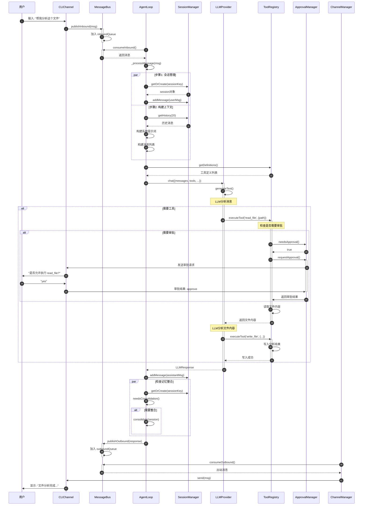

## 14. 组件依赖关系

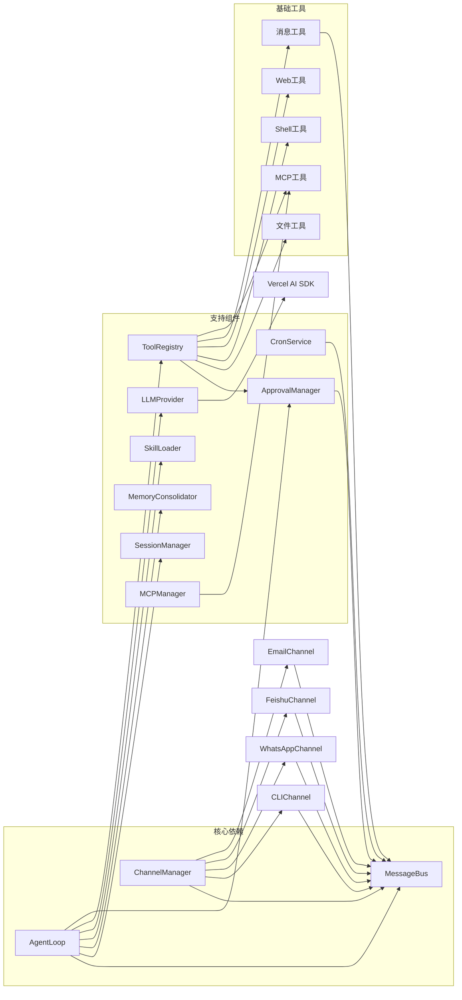

## 15. 数据流图

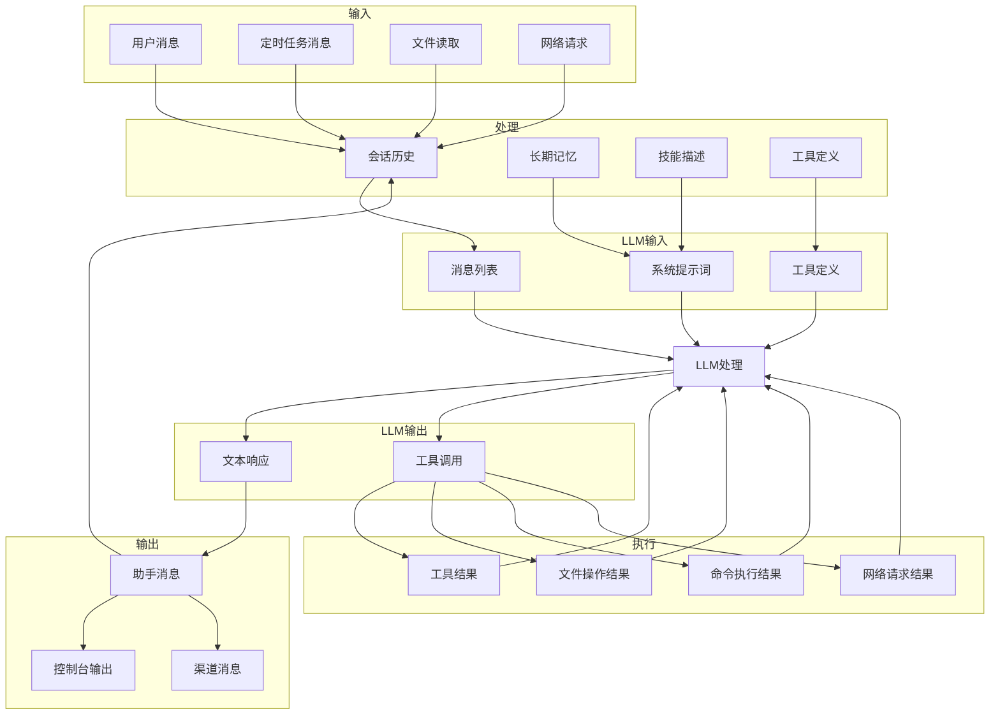

## 16. 并发处理模型

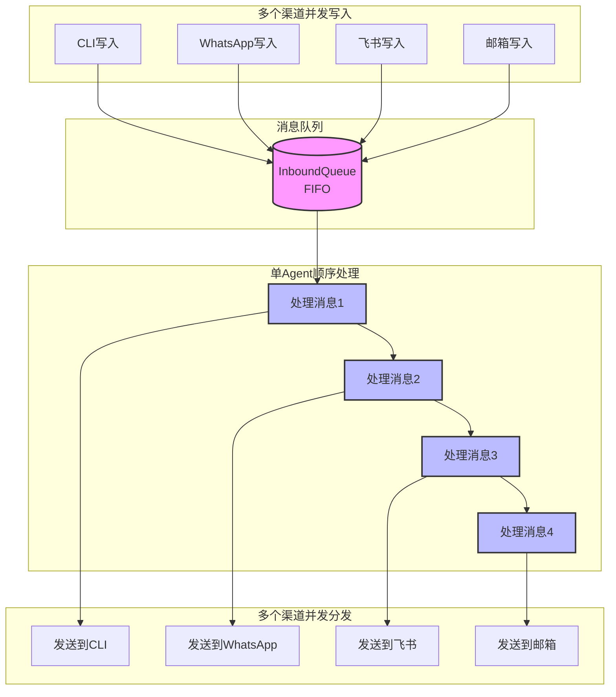

## 使用说明

这些 Mermaid 图表可以在以下地方查看和渲染：

1. **GitHub**: 直接在 README.md 中显示
2. **VS Code**: 安装 "Mermaid Preview" 插件
3. **在线编辑器**: https://mermaid.live/
4. **Notion/Obsidian**: 原生支持 Mermaid

要查看完整的架构和流程，建议配合 `GATEWAY_FLOW.md` 文档一起使用。
