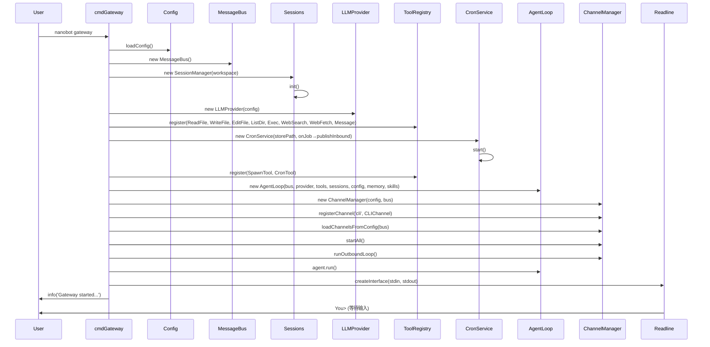
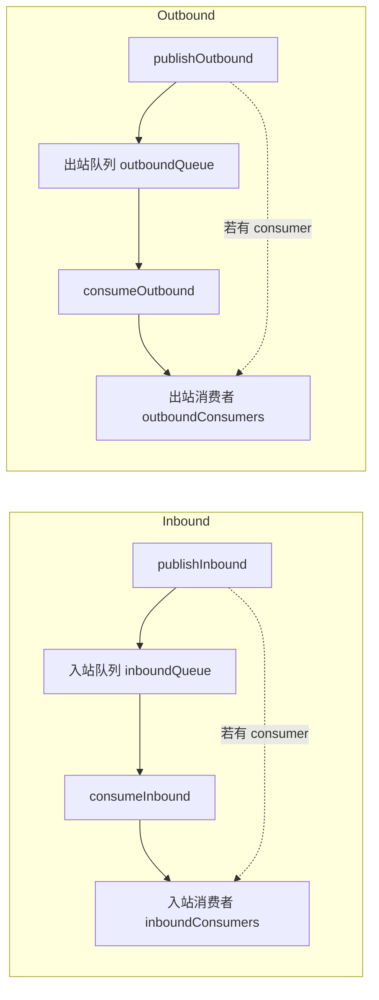
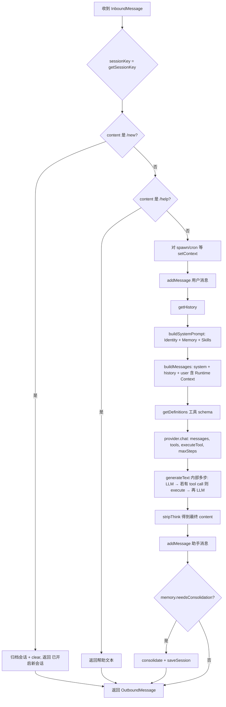
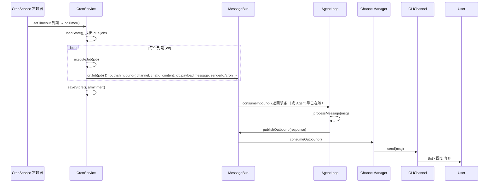

# Gateway 模式调用流程图

本文档描述 `nanobot gateway` 的完整调用链，从启动到用户输入、Agent 处理、工具执行、出站分发的全流程。

---

## 一、整体架构（启动后常驻组件）

```
┌─────────────────────────────────────────────────────────────────────────────────┐
│                          nanobot gateway 进程                                     │
├─────────────────────────────────────────────────────────────────────────────────┤
│  ┌──────────────┐     ┌─────────────┐     ┌──────────────┐     ┌─────────────┐  │
│  │   Readline   │     │ MessageBus  │     │  AgentLoop   │     │ ChannelMgr  │  │
│  │  (You> 输入)  │────▶│  inbound    │────▶│ consumeInbound│     │ outbound    │  │
│  └──────────────┘     │  outbound   │◀────│ publishOutbound│◀───│ consumeOutbound│
│         ▲             └──────┬──────┘     └───────┬──────┘     └──────┬──────┘  │
│         │                    │                    │                   │         │
│         │                    │                    │                   ▼         │
│         │                    │                    │            ┌─────────────┐  │
│         │                    │                    │            │ CLIChannel  │  │
│         │                    │                    │            │ .send(msg)  │  │
│         │                    │                    │            │ → Bot> 输出  │  │
│         │                    │                    │            └─────────────┘  │
│         │                    │                    │                             │
│         │                    │         ┌───────────┴───────────┐                 │
│         │                    │         │ LLMProvider.chat()    │                 │
│         │                    │         │ (generateText+execute)│                 │
│         │                    │         └───────────┬──────────┘                 │
│         │                    │                     │                             │
│         │                    │         ┌───────────▼───────────┐                 │
│         │                    │         │ ToolRegistry.execute  │                 │
│         │                    │         │ (read_file, exec...)  │                 │
│         │                    └─────────│ CronService.onJob ────┼──▶ publishInbound│
│         │                              └───────────────────────┘    (定时触发)   │
└─────────────────────────────────────────────────────────────────────────────────┘
```

---

## 二、启动顺序（cmdGateway 初始化流程）



---

## 三、用户输入到回复（单轮对话）

```mermaid
sequenceDiagram
    participant User
    participant RL as Readline
    participant Bus as MessageBus
    participant Agent as AgentLoop
    participant Session as SessionManager
    participant Context as ContextBuilder
    participant Provider as LLMProvider
    participant SDK as generateText (AI SDK)
    participant Tools as ToolRegistry
    participant Mgr as ChannelManager
    participant CLICh as CLIChannel

    User->>RL: 输入 "今天天气" + Enter
    RL->>Bus: publishInbound({ channel:'cli', chatId:'direct', content, senderId:'user' })
    Note over Bus: inboundQueue.push(msg); 若有 consumer 则 resolve(consumer)

    Agent->>Bus: consumeInbound()  # 被 resolve，拿到 msg
    Agent->>Agent: _processMessage(msg)

    Note over Agent: 1) sessionKey = getSessionKey(msg)
    Agent->>Agent: 2) 若 content 为 /new 或 /help，直接 return 出站
    Agent->>Agent: 3) 对 spawn/cron 等工具 setContext(channel, chatId)
    Agent->>Session: addMessage(sessionKey, { role:'user', content })
    Agent->>Session: getHistory(sessionKey, memoryWindow)
    Agent->>Context: buildSystemPrompt(memory, skills, workspace)
    Agent->>Context: buildMessages(systemPrompt, history, currentMessage, channel, chatId)
    Note over Agent: messages = [system, ...history, user with runtime context]

    Agent->>Provider: chat({ messages, tools, maxSteps, executeTool, onStepFinish })
    Provider->>Provider: buildToolsWithExecute(tools, executeTool)
    Provider->>SDK: generateText(model, messages, toolsWithExecute, stopWhen: stepCountIs(maxSteps))

    loop 多步直到无 tool call 或达到 maxSteps
        SDK->>SDK: 调用 LLM
        alt 模型返回 tool calls
            SDK->>Provider: 对每个 tool 调用 execute(args)
            Provider->>Tools: executeTool(name, args) 即 tools.execute(name, args)
            Tools->>Tools: 执行 read_file / exec / cron 等
            Tools-->>Provider: 返回字符串（可能被截断）
            Provider-->>SDK: "Tool \"xxx\" returned:\n..."
            SDK->>SDK: 将 tool 结果加入 messages，继续下一轮 generateText
        else 模型返回纯文本
            SDK-->>Provider: result.text
        end
    end

    SDK-->>Provider: result { text, usage }
    Provider-->>Agent: LLMResponse { content, hasToolCalls: false }
    Agent->>Agent: _stripThink(content)
    Agent->>Session: addMessage(sessionKey, { role:'assistant', content })
    Agent->>Agent: 若 memory.needsConsolidation 则 consolidate
    Agent->>Bus: publishOutbound({ channel, chatId, content })

    Note over Bus: outboundQueue.push(msg); 若有 consumer 则 resolve(consumer)
    Mgr->>Bus: consumeOutbound()  # 被 resolve，拿到 msg
    Mgr->>Mgr: getChannel(msg.channel)  # 例如 'cli'
    Mgr->>CLICh: send(msg)
    CLICh->>User: console.log('\nBot>', msg.content)

    RL->>User: You> (再次等待输入)
```

---

## 四、MessageBus 入站/出站队列与消费者



- **入站**：Readline / Cron / 其他 Channel 调用 `publishInbound`；唯一消费者是 **AgentLoop.run()** 里的 `consumeInbound()`。
- **出站**：Agent 在 `_processMessage` 结束后调用 `publishOutbound`；唯一消费者是 **ChannelManager._outboundLoop()** 里的 `consumeOutbound()`。

---

## 五、Agent _processMessage 内部步骤（细化）



---

## 六、Cron 定时触发入站



- Cron 的 **onJob** 只做一件事：按 job 的 `channel`/`to` 和 `message` 构造一条 **InboundMessage** 并 **publishInbound**，后续与「用户输入」走同一条 Agent → 出站 → Channel 链路。

---

## 七、ChannelManager 出站分发循环

```mermaid
flowchart TB
    A[_outboundLoop] --> B[msg = await bus.consumeOutbound]
    B --> C{channels.get(msg.channel)}
    C -->|有| D[channel.send(msg)]
    C -->|无| E[logger.warn 未注册渠道]
    D --> F{running?}
    E --> F
    F -->|是| B
    F -->|否| G[循环结束]
```

- 注册的 channel 至少有一个 **cli**（CLIChannel）；若 config 启用 whatsapp/feishu/email，也会在 **loadChannelsFromConfig** 里注册，出站时按 `msg.channel` 选对应 channel 的 **send(msg)**。

---

## 八、Provider.chat 与 AI SDK generateText

```mermaid
flowchart LR
    subgraph Agent
        A[chatParams: messages, tools, executeTool, maxSteps]
    end
    subgraph Provider
        B[buildToolsWithExecute: 每个 tool 加 execute]
        C[generateText(toolsWithExecute, stopWhen: stepCountIs(maxSteps))]
    end
    subgraph SDK
        D[步 1: LLM 调用]
        E{有 tool calls?}
        F[对每个 tool 调用 execute]
        G[把结果当 tool message 追加]
        H[步 2: 再调 LLM]
        I[重复直到无 tool call 或达到 maxSteps]
    end

    A --> B
    B --> C
    C --> D
    D --> E
    E -->|是| F
    F --> G
    G --> H
    H --> E
    E -->|否| I
```

- **executeTool** 在 Agent 里实现为：`tools.execute(name, args)` + 结果截断 + 包装成 `"Tool \"name\" returned:\n..."` 字符串，由 Provider 注入到每个 tool 的 **execute**，SDK 在内部多步循环中自动调用。

---

## 九、文件与角色速查

| 角色 | 文件 | 职责 |
|------|------|------|
| 入口 | `src/cli/commands.ts` | `cmdGateway`: 组装 Bus、Sessions、Provider、Tools、Cron、Agent、ChannelManager，启动 agent.run 与 readline |
| 总线 | `src/bus/queue.ts` | `MessageBus`: inbound/outbound 队列与 publish/consume |
| 代理 | `src/core/agent.ts` | `AgentLoop.run` 消费 inbound，`_processMessage` 内调 provider.chat（带 executeTool/maxSteps），最后 publishOutbound |
| 渠道管理 | `src/channels/manager.ts` | 注册 channel，startAll，`_outboundLoop` 消费 outbound 并 `channel.send(msg)` |
| CLI 渠道 | `src/channels/cli.ts` | `CLIChannel.send` 输出 `Bot> content`；gateway 里 Readline 输入时 publishInbound(cli, direct) |
| 定时任务 | `src/cron/service.ts` | 定时到期后 onJob → publishInbound，触发 Agent 处理 |
| LLM | `src/providers/registry.ts` | `chat` 里 buildToolsWithExecute + generateText(maxSteps)，工具由 SDK 自动执行 |

---

以上为 Gateway 模式的完整调用流程与关键数据结构关系；若需某一段的代码级行号或更多分支（如 /new、memory consolidate），可再按模块细化。
